# 信息安全导论作业——S-AES加密

## 一、背景介绍

​		AES是高级加密标准，在密码学中又称Rijndael加密法，是美国联邦政府采用的一种区块加密标准。这个标准用来替代原先的DES，目前已经被全世界广泛使用，同时AES已经成为对称密钥加密中最流行的算法之一。

​		S-AES是AES加密方法的简化版，是由圣塔·克拉拉大学的Edward Schaefer教授和他的几名学生开发的，是一个面向教育的算法。了解并实现S-AES能对掌握AES有很大的帮助。

## 二、算法流程

### 总体流程

​		下图是S-AES的整体结构。

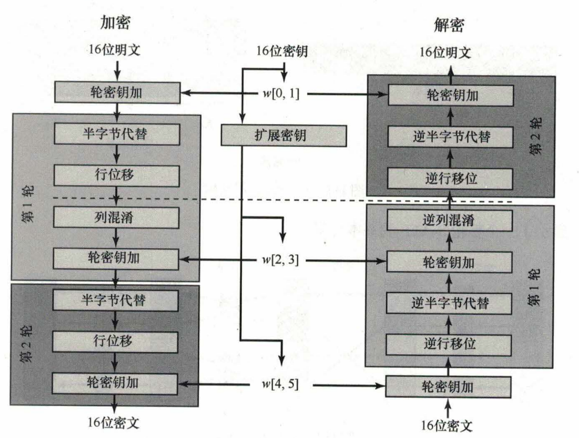

​		加密算法被组织成三轮。第0轮是简单的密钥加轮；第1轮是包含4个函数的完整轮；第2轮仅包含3个函数。每轮都使用16位密钥的密钥加函数。初始的16位密钥被扩展到48位，以便每轮都可使用一个不同的轮密钥。

​		在流程中，每个函数都可被视作2*2半字节矩阵的16位状态上操作，其中半字节是4-bit。值得注意的是，与常见的矩阵不同，状态矩阵是按列排序的，因此加密密文的前8-bit占据矩阵第1列，后8-bit占据第2列。下图是S-AES的数据结构。

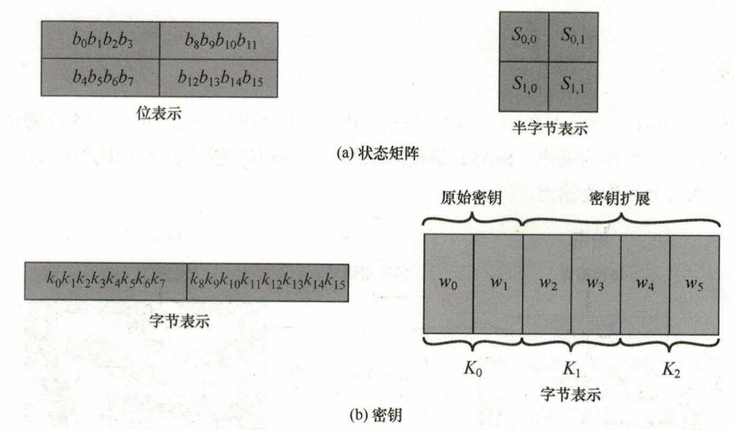

​		解密算法的流程中，函数的顺序与加密算法稍有不同。下面介绍算法的各个函数。

### 具体函数

#### 1.轮密钥加

​		密钥加函数将16-bit轮密钥与16-bit的状态矩阵作异或，可将其视为逐位、逐半字节或逐列操作。下面是一个例子。

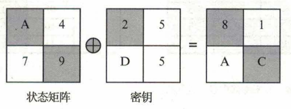

#### 2.半字节代替

​		半字节代替函数是一个查表操作。用4*4的半字节值矩阵存放表值，称为S盒。状态中每个半字节的左侧2位作用于S盒的行值，右侧2位作用于S盒的列值，这样一个半字节就能找到S盒中的一个十六进制数作为代替后的半字节。下面是一个半字节代替的例子。

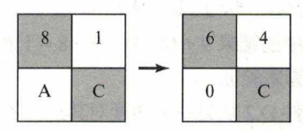

​		解密时使用逆S盒。S盒、逆S盒的数据如下图所示。

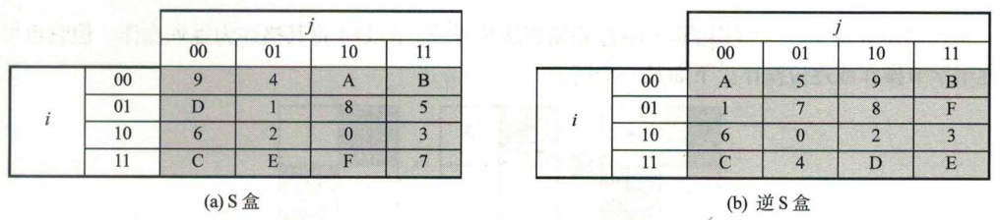

​		对一个半字节，进行一次半字节代替和一次逆半字节代替可以得到它本身

#### 3.行移位

​		行移位函数是将状态的第二行执行一个半字节循环移位，第一行不变。下面是一个例子。

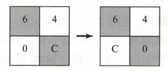

#### 4.列混淆

​		列混淆函数通过矩阵乘法的形式，将状态矩阵的每一个半字节都映射为一个新值。下面是定义。

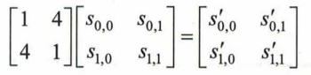

​		列混淆函数比较复杂，下面是运算流程。

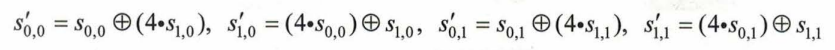

​		加法和乘法都是在GF(2^4)上执行，加法在此有限域上是异或运算，乘法另有计算过程。

​		解密时用到逆列混淆函数，下面是定义。

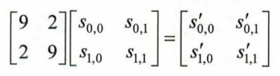

​		状态经过列混淆和逆列混淆后可以得到它本身。

#### 5.密钥扩展

​		输入的密钥是16位的，我们要将其扩展成3个密钥以方便在不同的轮次中使用。密钥扩展的算法流程如下图。

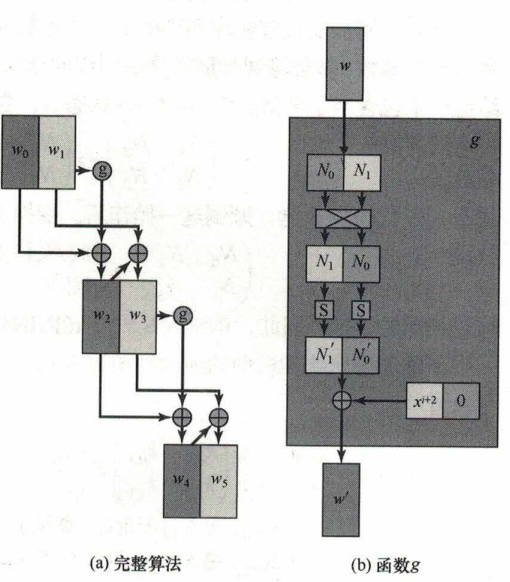

​		初始密钥2*2半字节矩阵按列分为2个8位字w0和w1。w1经过g算法得到的新的8位字与w0做异或得到w2，w2与w1做异或得到w3，w2与w3组成第二把密钥，第三把密钥的获取同理。

### 运行环境

Python 3.9,

NVIDIA RTX 4090 GPU,

i9-13980HX CPU

## 三、关卡测试

### 第一关：基本测试

根据S-AES算法编写和调试程序，提供GUI解密支持用户交互。输入可以是16bit的数据和16bit的密钥，输出是16bit的密文。

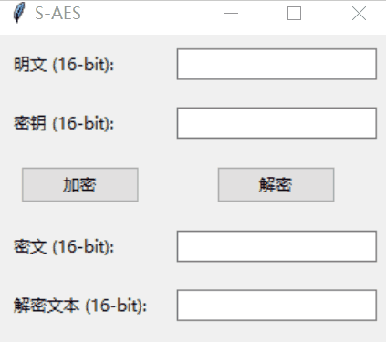

### 第二关：交叉测试

​		考虑到是"**算法标准"**，所有人在编写程序的时候需要使用相同算法流程和转换单元(替换盒、列混淆矩阵等)，以保证算法和程序在异构的系统或平台上都可以正常运行。

​		设有A和B两组位同学(选择相同的密钥K)；则A、B组同学编写的程序对明文P进行加密得到相同的密文C；或者B组同学接收到A组程序加密的密文C，使用B组程序进行解密可得到与A相同的P。

​		明文：1100100101000111
​		密钥：0010110101010101

​		结果如下

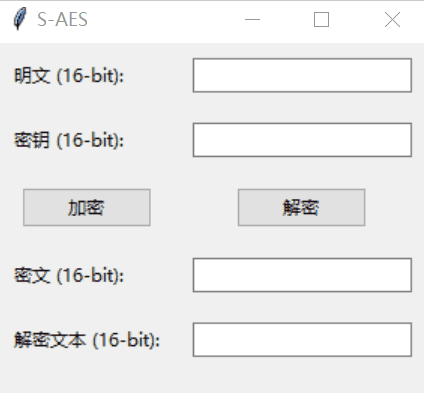

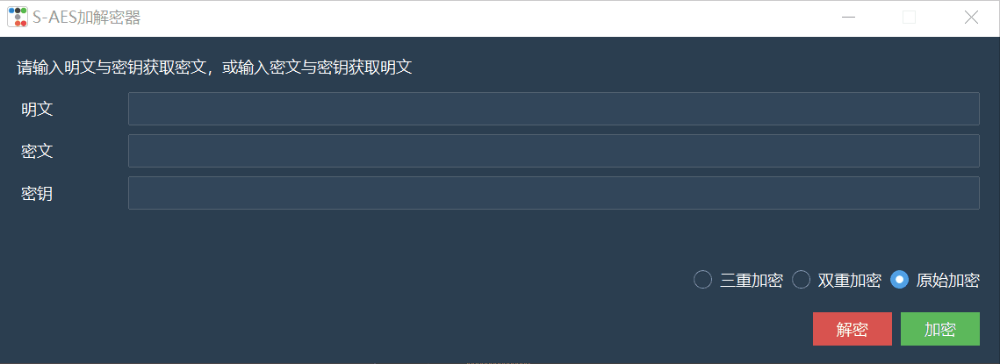

### 第三关：扩展功能

考虑到向实用性扩展，加密算法的数据输入可以是ASII编码字符串(分组为2 Bytes)，对应地输出也可以是ACII字符串(很可能是乱码)。

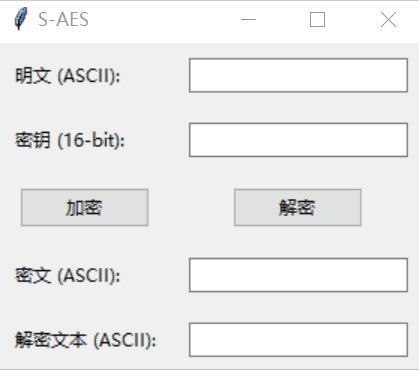

### 第四关：多重加密

#### 1.双重加密

将S-AES算法通过双重加密进行扩展，分组长度仍然是16 bits，但密钥长度为32 bits。

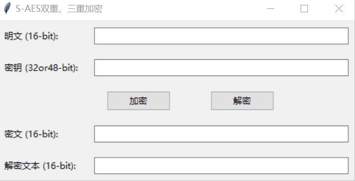

#### 2.中间相遇攻击

假设你找到了使用相同密钥的明、密文对(一个或多个)，请尝试使用中间相遇攻击的方法找到正确的密钥Key(K1+K2)。

破解：这里用使用相同密钥的两对明密文对进行密钥破解

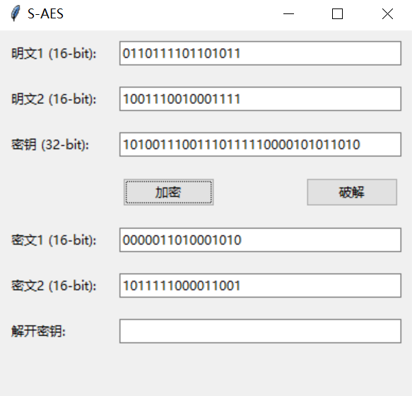

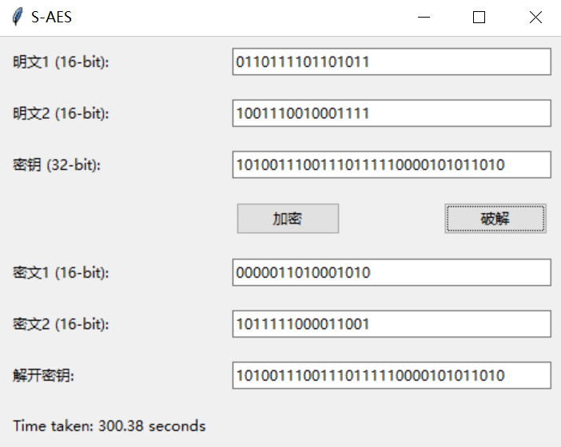

​		更换其中一串明文，加密并破解，得到两串密钥，第二串是我们想要的。

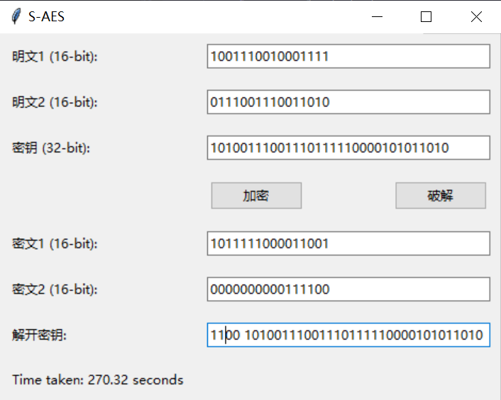

#### 3.三重加密

使用48bits(K1+K2+K3)的模式进行三重加解密

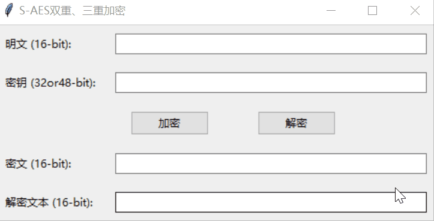

### 第五关：工作模式

基于S-AES算法，使用密码分组链(CBC)模式对较长的明文消息进行加密。注意初始向量(16 bits) 的生成，并需要加解密双方共享。

在CBC模式下进行加密，并尝试对密文分组进行替换或修改，然后进行解密，请对比篡改密文前后的解密结果。

加密：

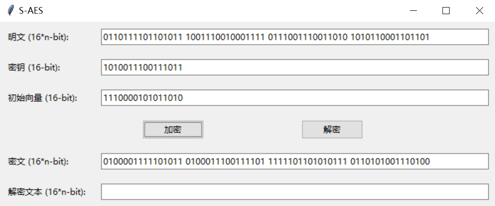

解密：

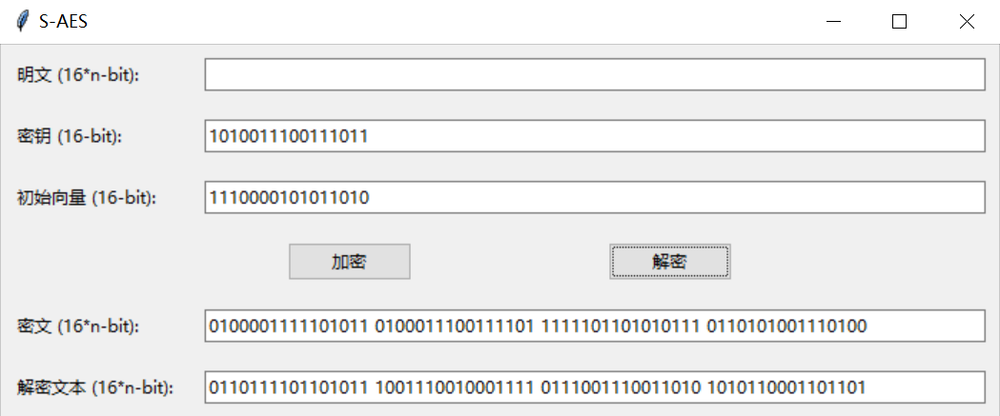

将密文[0, 1, 2, 3]的顺序改为[1, 2, 3, 0]进行解密：

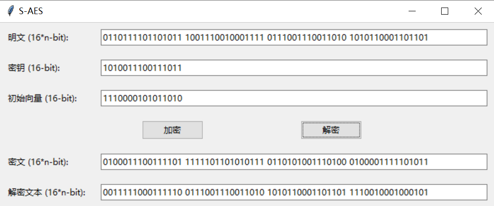

可以看到解密文本[2, 3]往左移了一段，另外两段解密文本有变化，这可能是与CBC的结构有关。