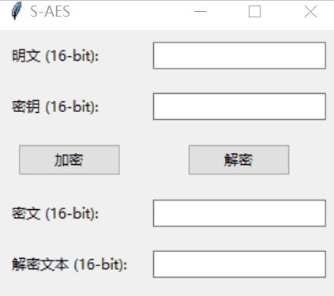
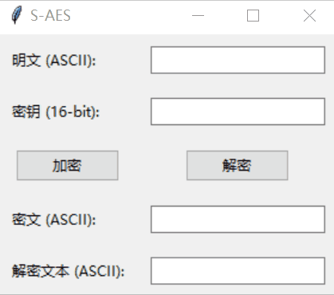
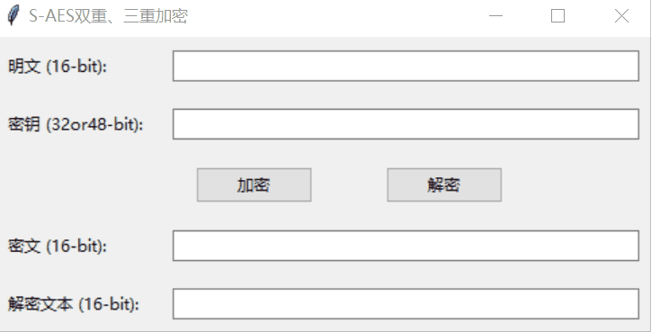

# 用户指南

## 目标用户

本用户指南提供给学习AES算法的

## 环境配置

需要python3环境

## 程序功能

### 1.基础加解密

运行stage_1.py，输入明文和密钥就可以进行加密，可以直接用得到的密文马上进行解密，以此来观察解密文本与明文。

### 2.加密ASCII码编码字符串

运行stage_3.py，输入ASCII码字符串和密钥进行加密，可以得到ASCII编码的密文，直接进行解密可以获得解密文本。

### 3.多重加密

运行stage_4.py，第一个窗口是用来做多重加密的，输入16-bit的明文和32-bit或48-bit的密钥进行解密，可以获得密文。同样的，直接进行解密可以获得解密文本。

运行stage_4.py，第二个窗口是用来做中间相遇攻击的，输入两串明文和一串32-bit密钥进行加密，可以得到两串密文，这时进行破解操作，等待5-6分钟后可以得到破解的32-bit的密钥，密钥可能不止一个。

### 4.CBC模式

运行stage_5.py，以单个空格作为间隔，输入n组16-bit的明文，输入一串16-bit的密钥和一串16-bit的初始向量进行加密，可以得到n组16-bit的密文，进行解密可以得到n组16-bit的解密文本。

